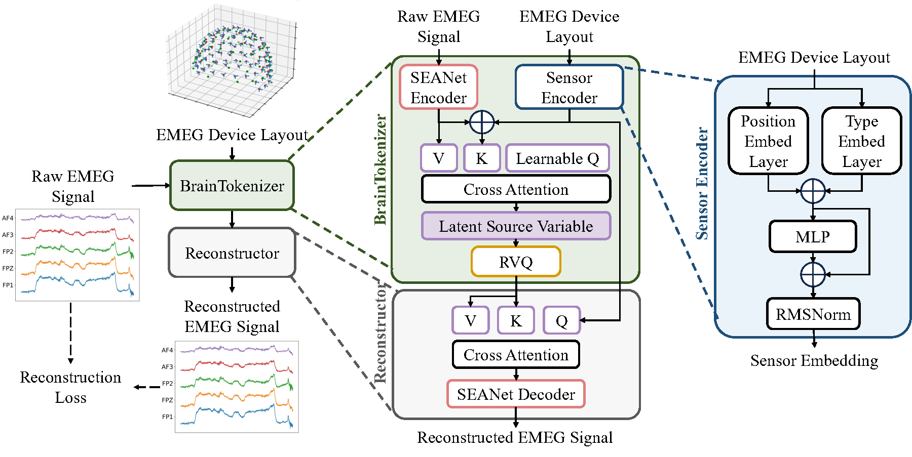
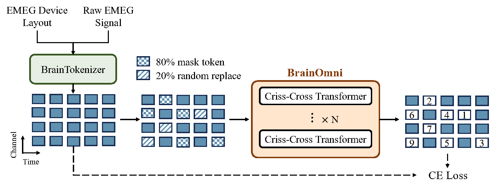

# BrainOmni 🧠

<div align="center">

[](https://arxiv.org/abs/2505.18185)
[](https://neurips.cc/virtual/2025/poster/117066)
[](https://huggingface.co/OpenTSLab/BrainOmni)

</div>


Official Repository of the paper:
BrainOmni: A Brain Foundation Model for Unified EEG and MEG Signals (NeurIPS 2025)

## Method
<p align="center">
  
</p>

<p align="center">
  
</p>

<div align="center">

<b>Overview of BrainOmni</b>

</div>

## 🔨 Setup

The project is developed with Python 3.10.14, and the cuda version is 12.4

Install dependencies with 
```bash
pip install -r requirements.txt
```

## 🍕 Released Checkpoint
We have released the checkpoints of  `BrainOmni_tiny`, `BrainOmni_base` and `BrainTokenizer` on [Hugginface🤗](https://huggingface.co/OpenTSLab/BrainOmni).

See `demo.ipynb` for how to use BrainOmni.

## 📚 File Structure
```plaintext
.
├── train_omni_results          # Checkpoint directory for BrainOmni
├── train_tokenizer_results     # Checkpoint directory for BrainTokenizer
├── exp_results_downstream      # Downstream evaluation results
├── ckpt_collection             # Put downloaded checkpoint here
├── braintokenizer              # Source code for BrainTokenizer (Stage1) training
├── brainomni                   # Source code for BrainOmni (Stage2) training
├── data                    
│   ├── evaluate                # Put the downloaded evaluate dataset under here (one subdirectory per dataset)
│   │   ├── dataset1
│   │   └── dataset2
│   ├── raw                     # Put the downloaded pretrain dataset under here (one subdirectory per dataset)
│   │   ├── dataset1
│   │   └── dataset2
│   ├── processed_evaluate      # Preprocessed data for evaluation. Created automantically.
│   └── processed_pretrain      # Preprocessed data for pretraining. Created automantically.
├── downstream                  # Source code for downstream
├── factory                     
├── model_utils
├── script                      # Shell scripts
└── share                       
    ├── custom_montages         # Layout files for some specific datasets
    │   ├── dataset1.tsv
    │   └── dataset2.tsv
    └── metadata                # Json files for metadata of preprocessed data. Generated automantically.
```


## 🚢 Pretraining

### Data preprocessing
To preprocess pretraining datasets, run 
```bash
# see script/pretrain_preprocess.sh
python factory/process.py --time xx --stride xx --max_workers xx
```
- `time`: Duration of each data segment (unit in second).
- `stride`: stride when segmenting

When incorporating a new dataset, place its custom montage file (if applicable) into `share/custom_montages`, and update the `CUSTOM_MONTAGE_DICT` in `factory/brain_constant.py`. If no custom montage is provided, define a standard MNE montage in the `MONTAGE_DICT` within the same file.

### Model training
For BrainTokenizer pretraining, run the command as follows:
```bash
# see script/train_braintokenizer.sh
export PYTHONPATH=./
deepspeed  --num_gpus=8 \
   braintokenizer/launcher.py \
   --launcher=pdsh \
   --signal_type=both \
   --epoch=16 \
   --codebook_size=512 \
   --codebook_dim=256 \
   --num_quantizers=4 
```


The procedure for BrainOmni pretraining (Stage 2) is similar. Refer to `script/train_brainomni.sh` for detailed instructions.

After training, checkpoints will be organized as follows within `train_omni_results` or `train_tokenizer_results`
```plaintext
exp_2025-07-02_12:00
├── exp_name
│   └── model_cfg.json
├── checkpoint
│   ├── best
│   ├── latest
│   └── zero_to_fp32.py
├── events.out.tfevents.xxx
└── logs.txt
```
To convert DeepSpeed checkpoints to standard PyTorch format, navigate to the `checkpoint` directory and execute:
```bash
./zero_to_fp32.py . output_directory
```

The converted checkpoint (`pytorch_model.bin`) will be stored in `output_directory`. Rename it accordingly (e.g., `BrainTokenizer.pt` or `BrainOmni.pt`) and relocate it to the same folder of `model_cfg.json`. This combined directory will be used for setting `tokenizer_path` or `ckpt_path` in shell scripts.

## ⛵ Downstream finetuning

### Data preprocessing
1. Put the downstream dataset under ./data/evaluate/
2. Run the corresponding preprocessing code : `python downstream/dataset_maker/make_xx.py`
3. Run `python downstream/dataset_maker/dataset_spliter.py` to split the data into 5-fold(cross-subject). 

### Downstream evaluation
Considering that the baseline and our model have different architectures and parameter sizes, for each model and each dataset, we conducted experiments using three learning rates (3e-6, 1e-5, 3e-5) selected the best-performing learning rate as the configuration.  

For each experiment, we employed 5-fold cross-validation and conducted twice using random seeds 42 and 3407. Ultimately, we report the average results from these 10 experimental runs.

```bash 
# run downstream evaluation
sh script/evaluation.sh
```
Use the following command to calculate the average results of 10-fold cross-validation in an experiment.
```bash 
# The average results will be saved in exp_results_downstream/results.csv
python downstream/metrics_stat.py
```

## 📢 Citation

If you use BrainOmni model or code, please cite the following paper:

> Qinfan Xiao, Ziyun Cui, Chi Zhang, Siqi Chen, Wen Wu, Andrew Thwaites, Alexandra Woolgar,
Bowen Zhou, Chao Zhang (2025) BrainOmni: A Brain Foundation Model for Unified EEG and MEG Signals,
_NeurIPS 2025_, [https://arxiv.org/abs/2505.18185](https://arxiv.org/abs/2505.18185)
